# NCU-Network-Management-2020
## 簡介
- **學校** : 國立中央大學
- **開課單位** : 機械工程學系
- **課程名稱** : 電腦網路及程式
- **授課教授** : 林錦德 助理教授
- **修課時間** : 2020年02月~2020年06月
- **最終成績** : 95

## 課程內容
1. 網路基礎架構
   * OSI
   * TCP/IP
   * 拓譜
   * 遮罩
   * 集線器、交換器、路由器
2. 前端
   * html
   * CSS
   * Javascript
3. 後端
   * PHP
4. 資料庫
   * SQLite
5. Linux
   * 作業系統
   * 虛擬化
   * 基本指令
   * WSL
6. AWS
   * AWS基本介紹
   * EC2
   * RDS
7. 期末專題

## 後端(php)
**題目**:轉置(transpose)一個3x3矩陣，並顯示結果

**線上體驗網址**：[PHP 矩陣轉置練習](http://pocper.great-site.net/net-mgmt/php-exercises/)

點擊展開：查看結果畫面截圖

- Input  
  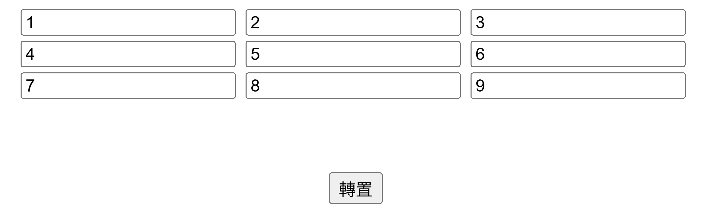  
- Output  
  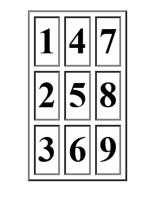

## 期末考試(html/css/javascript/php/AWS database)
1. **題目一**：設計一個購物書平台，當使用者採購相對應的數目時，資料庫會顯示對應的數量。

   **線上體驗網址**：[線上購物書平台](http://pocper.great-site.net/net-mgmt/final-exam/bookstore/)
    

    
點擊展開：查看結果畫面截圖

    - Input  
        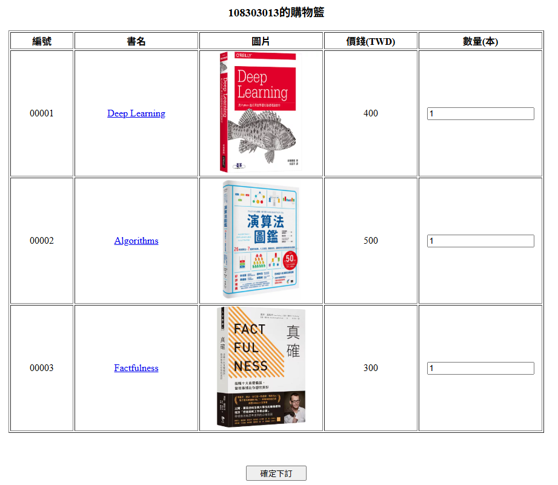
    - Output  
        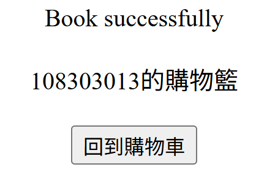
    

 

2. **題目二**：使用者輸入兩個不同的年月，可以計算出相差多少個月份
   
   **線上體驗網址**：[計算兩日期之月份差異計算機](http://pocper.great-site.net/net-mgmt/final-exam/month-diff/)

    

    
點擊展開：查看結果畫面截圖

    - Input  
        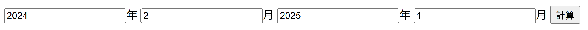
    - Output  
        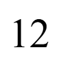
    

## 期末專題(html/css/javascript/php/AWS database)

**題目**：設計至少三個不同的網頁且含有後端與資料庫互動的網站

**線上體驗網址**：[期末專題首頁（魔塔＆貪吃蛇）](http://pocper.great-site.net/net-mgmt/final-project/)

**網頁介紹：** 本網站以遊戲為主題，內容涵蓋經典的「貪吃蛇」以及「瘋狂魔塔」兩款遊戲，並整合後端資料庫實作玩家註冊、登入以及遊戲進度即時存檔/讀檔機制。

**貪吃蛇故事背景：** 貪吃蛇是一款經典的休閒遊戲，玩家控制一條不斷成長的蛇，在有限的空間內吃食物並避免撞牆或咬到自己。遊戲簡單卻極具挑戰性，考驗玩家的反應速度與策略規劃能力。

**瘋狂魔塔故事背景與說明：** 瘋狂魔塔是一款經典的角色扮演遊戲，玩家操控主角在多層魔塔中逐層挑戰怪物與陷阱，尋找通往頂層的道路。原始遊戲是以Flash製作（如[遊戲天堂-瘋狂魔塔](https://i-gamer.net/play/663.html)所示），由於Flash已停止支援，我們自行重新設計並開發了此遊戲的版本，並非直接使用Flash原作，而是以其遊戲機制為靈感來源，完成了部分實作。

**成員及工作內容:**  

|　　成員　　| 工作內容                                         |
| :-------- | :-----------------------------------------------|
| 黃鉦淳   | 主頁:HTML、CSS、JavaScript 編寫 關於我們:HTML、CSS、JavaScript 編寫 遊戲_貪吃蛇:HTML、CSS、JavaScript 編寫 遊戲_瘋狂魔塔:HTML、CSS、JavaScript (遊戲關卡設計 / 角色互動機制 / 角色碰撞機制 / 美術及素材製作) |
| 郭耀中   | 瘋狂魔塔:php(進度保存至資料庫的後端開發與資料庫設計) |

點擊展開：查看結果畫面截圖

- 主頁
   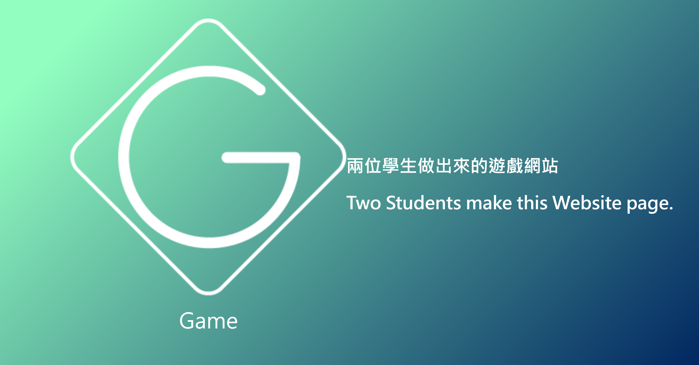
   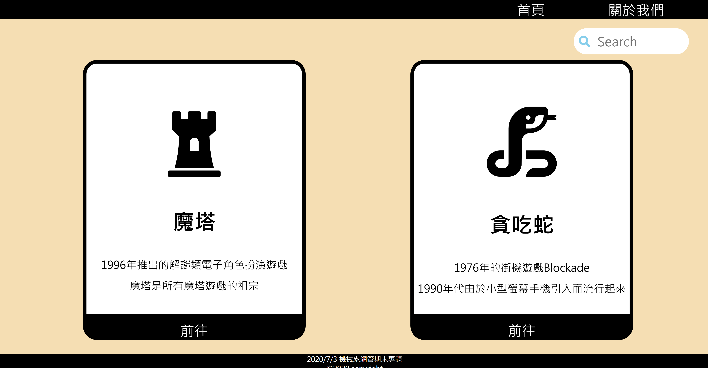
- 關於我們
   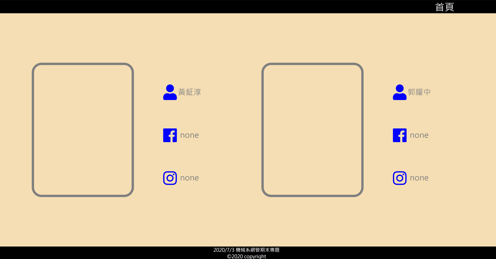
- 遊戲_貪吃蛇
   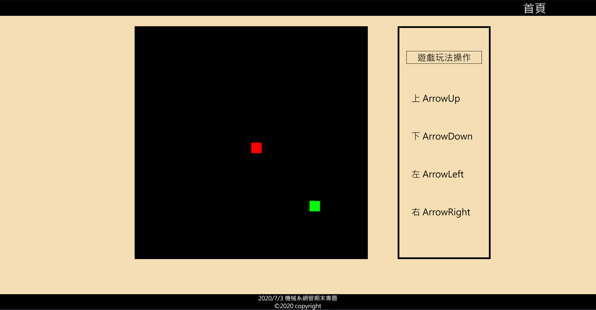
- 遊戲_瘋狂魔塔
   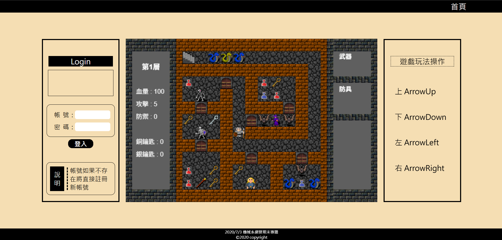
   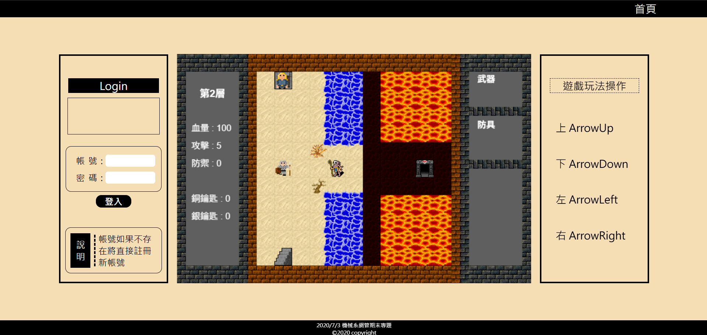
   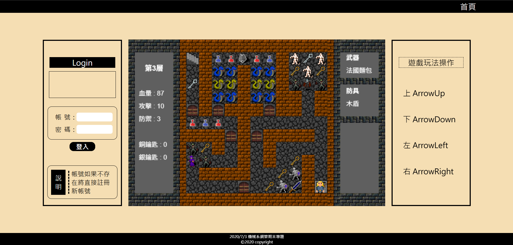
   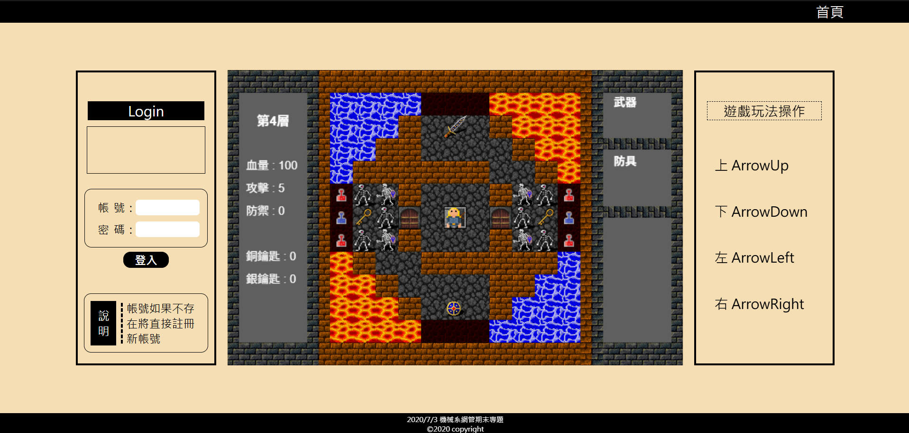
   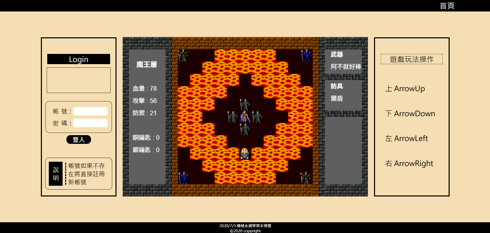
   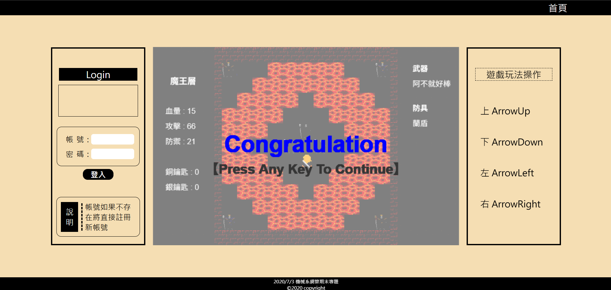
   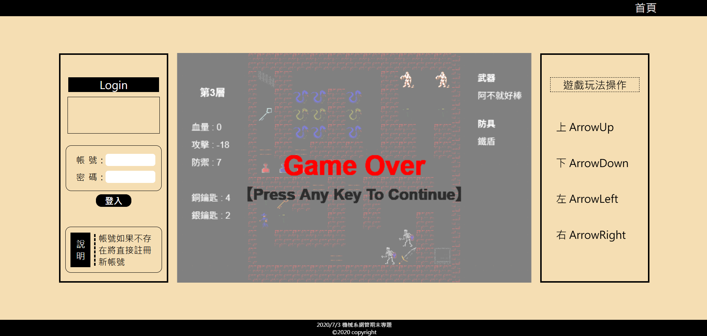

